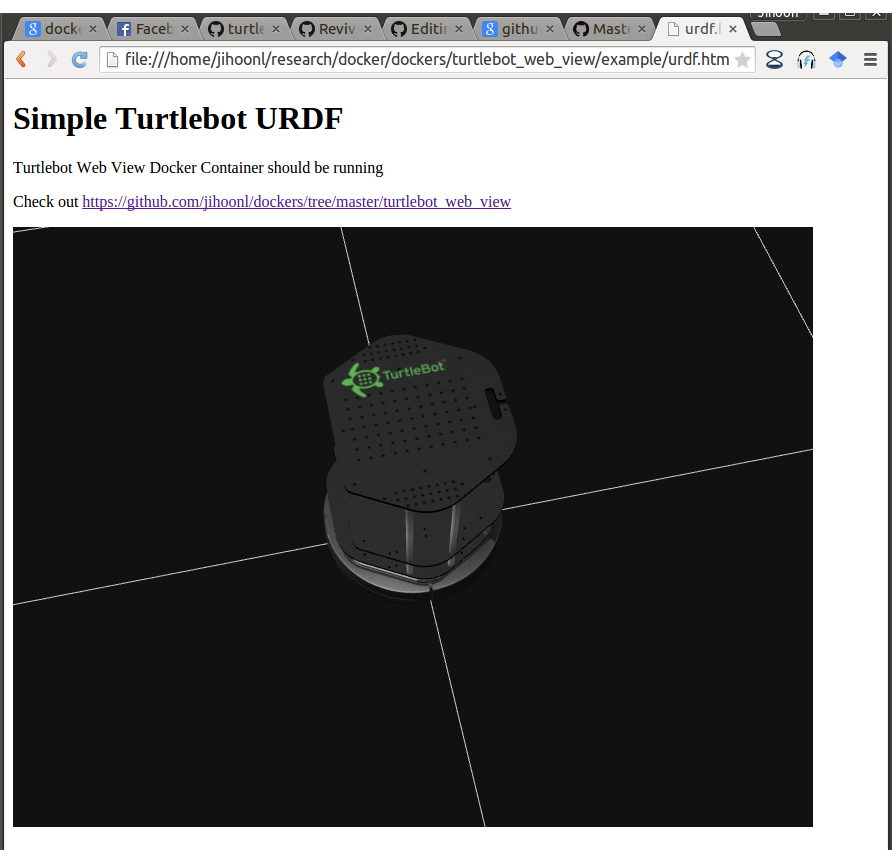

# Turtlebot Web View Docker

## Prerequisite

```
  sudo apt-get install docker.io
  sudo docker.io pull jihoonl/turtlebot-web-view
```

## Execution

1. Starts Docker Container. Rsbridge port will be exposed as localhost:8888
```
 > sudo docker.io run -d -p 8888:9090 jihoonl/turtlebot-web-view
```

2. Open [urdf.html](example/urdf.html) 

</img>


## Customise 

1. Edit [Dockerfile](Dockerfile) and image name in [build_environment.sh](build_environment.sh)

2. Create image 

```
  ./build_environment.sh
```
